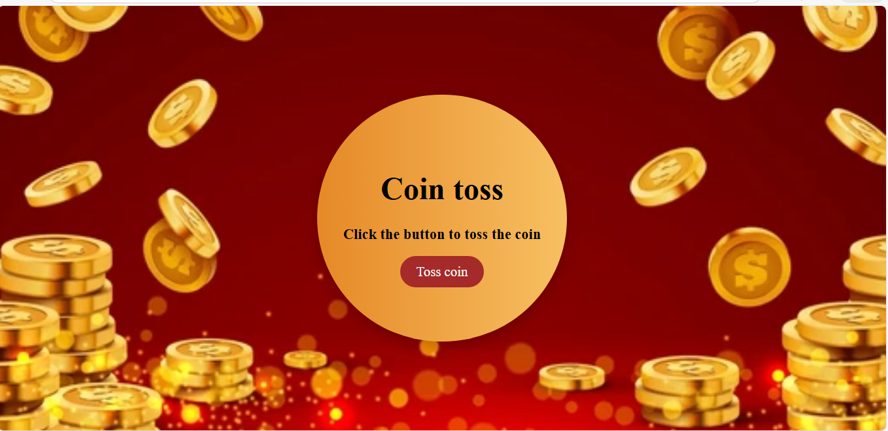

# Coin Toss Game 

A simple and interactive **Coin Toss Game** built using **HTML, CSS, and JavaScript**. Users can click a button to toss a virtual coin and see the result (Heads or Tails) instantly. This project demonstrates DOM manipulation, event handling, and responsive design.

---

## Features

- Interactive coin toss functionality  
- Displays the result dynamically on the page  
- Responsive design for desktops, tablets, and mobile devices  
- Simple and clean UI with modern styling  

---

## How to Use

1. Clone or download the repository:

```bash
git clone https://github.com/ayeshanoor-codes/coin-toss.git
````

2. Open `index.html` in your browser.
3. Click the **"Toss coin"** button to see the result.

---

## Tech Stack

* **HTML** – Structure of the page
* **CSS** – Styling and responsive design
* **JavaScript** – Coin toss logic and DOM manipulation

---

## Screenshot



---
## Preview

[https://coin-toss-project.netlify.app/]

---


## Author

Developed by **Ayesha Noor**.

---

If you like this project, consider giving the repo a ⭐ on GitHub!

